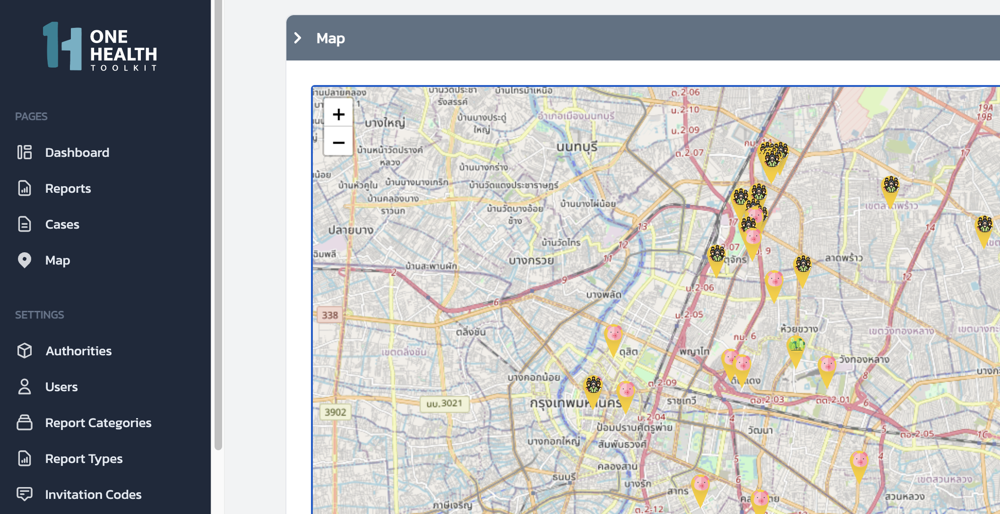

# OHTK MS
The OHTK Management System allows local authorities to track incoming reports, manage cases, and respond to outbreaks.



## Setting up OHTK-MS
---
#### What you'll need

- [Node.js](https://nodejs.org/en/download/) version 16.14 or above:
  - When installing Node.js, you are recommended to check all checkboxes related to dependencies.
- NextJS
- React
- [React-DOM](https://www.npmjs.com/package/react-dom)

```bash
npm install next react react-dom
```

#### Install

Get latest version of ohtk-ms from github:

```bash
git clone https://github.com/onehealthtoolkit/ohtk-ms.git
```

```bash
cd ohtk-ms
```

#### Start Localhost Server

```bash
npm run dev
```

Navigate to your local host port 3000:

[http://localhost:3000](http://localhost:3000)

#### Create Required OHTK Data

You need to create some records in order to use the mobile app – Authorities, Report Categories, Report Types, etc


## How To Use OHTK-MS

#### [OHTK User Guide](https://docs.google.com/document/d/1Kq7mS5Mlw7qJRNxuzRu_7ozVRcIgLcUCJ-Xf1qy7Uyc/edit#bookmark=id.8ojptaw7yhmd)